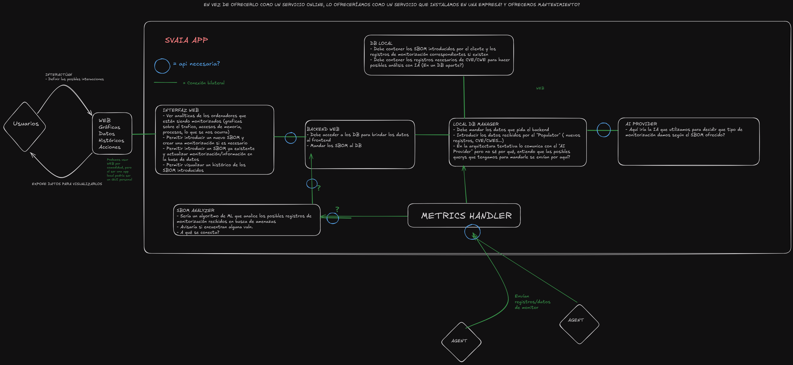
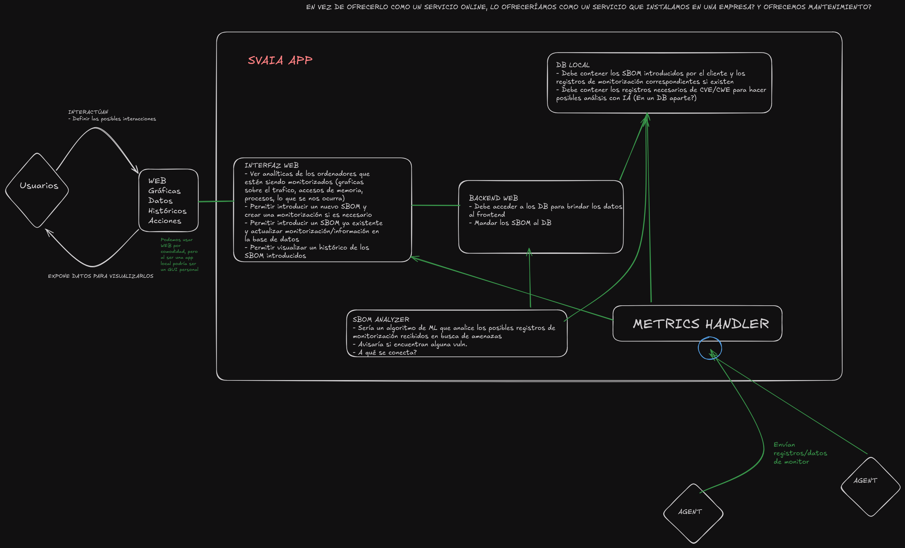

# Documentación de Desarrollo

## Resumen del Proyecto
SVAIA_MON es un sistema modular para la monitorización y análisis de seguridad de proyectos software. Incluye componentes para gestión de proyectos, análisis de SBOM, manejo de métricas y logs seguros, y una interfaz web para interacción de usuarios.

## Dificultades y Decisiones de Desarrollo
- El desarrollo se realizó integrando prácticas previas y nuevas necesidades, lo que llevó a una arquitectura menos cohesionada de lo planeado.
- Se optó por una base de datos local para pruebas, ya que la base de datos original no se ajustaba a los requisitos.
- Algunas decisiones, como el uso de WebSockets, fueron deliberadas para mejorar la comunicación en tiempo real.

## Arquitectura
La arquitectura prevista era modular, pero la versión actual es más acoplada debido a limitaciones de tiempo y experiencia. A continuación se muestran ambos enfoques:

### Arquitectura Prevista

### Arquitectura Real

### Diagrama de Componentes

## Componentes Principales
- **web-gui**: Interfaz web para usuarios, desarrollada con Flask y Jinja2.
- **web_api**: API REST para gestión de proyectos y comunicación entre módulos.
- **metrics_handler**: Servicio FastAPI para recibir y procesar métricas de agentes.
- **sbom_analyzer**: Servicio FastAPI para análisis de SBOMs (actualmente soporta CycloneDX 1.6 JSON, planea soportar SPDX 3.0.1).
- **agents**: Agente en Rust para monitorización de sistemas remotos.
- **secure_log_manager**: Módulo para gestión segura de logs.
- **mock-bd**: Base de datos local para pruebas y almacenamiento temporal.

## Flujo de Trabajo
1. El usuario crea un proyecto desde la web.
2. Se sube un SBOM y se analizan vulnerabilidades.
3. Los agentes envían métricas al sistema.
4. Los resultados y métricas se visualizan en la web.
5. Los logs se gestionan de forma segura.

## Despliegue y Ejecución
- El script `deploy.sh` permite iniciar y detener todos los servicios.
- Se recomienda usar un entorno virtual y sincronizar dependencias con `uv` o `pip`.
- Los agentes pueden compilarse con `cargo` si se requiere.

## Referencias
- [README.md](../README.md)
- [docs/README.md](./README.md)
- [svaia/sbom_analyzer/README.md](../svaia/sbom_analyzer/README.md) 