# Documentación de Pruebas

## Estrategia de Testing
El proyecto utiliza `pytest` y `unittest` para la validación de los diferentes módulos. Los tests cubren tanto la funcionalidad de los servicios web (FastAPI, Flask) como la lógica de análisis y gestión de logs.

## Estructura de los Tests
- Los tests se encuentran en las carpetas `test/` de cada módulo principal.
- Se utilizan clientes de prueba para simular peticiones HTTP y WebSocket.
- Se incluyen pruebas de integración, validación de errores y robustez ante entradas maliciosas.

## Diagrama de Cobertura de Tests

```mermaid
flowchart TD
    T1["pytest"] --> T2["svaia/sbom_analyzer/test/test_sbom_analyzer.py"]
    T2 --> T3["TestSbomAnalyzer"]
    T3 --> T4["test_ping"]
    T3 --> T5["test_if_empty_sbom_doesnt_parse"]
    T3 --> T6["test_if_wrong_sbom_doesnt_parse"]
    T3 --> T7["test_correct_sbom_parses_and_gives_correct_results"]
    T3 --> T8["test_unsupported_sbom_format"]
    T3 --> T9["test_malicious_sbom_content"]
    T3 --> T10["test_rate_limiting"]
    T1 --> T11["svaia/metrics_handler/test/test_metrics_handler.py"]
    T11 --> T12["TestWebSocketEndpoints"]
    T12 --> T13["test_agent_rejects_invalid_token"]
    T12 --> T14["test_client_rejects_invalid_token"]
    T12 --> T15["test_valid_agent_and_client_communication"]
    T12 --> T16["test_agent_flooding"]
    T12 --> T17["test_malformed_json"]
    T12 --> T18["test_unauthorized_after_valid"]
    T1 --> T19["svaia/secure_log_manager/test/test_secure_log_manager.py"]
    T19 --> T20["TestSecureLogManager"]
    T20 --> T21["test_verificar_cadena_real"]
    T20 --> T22["test_log_tampering_detection"]
    T20 --> T23["test_invalid_log_level"]
```


## Principales Casos de Prueba

### SBOM Analyzer
- **test_ping**: Verifica que el servicio responde correctamente.
- **test_if_empty_sbom_doesnt_parse**: Asegura que un SBOM vacío no es aceptado.
- **test_if_wrong_sbom_doesnt_parse**: Valida que un SBOM mal formado es rechazado.
- **test_correct_sbom_parses_and_gives_correct_results**: Comprueba que un SBOM válido es procesado y se detectan las CVEs esperadas.
- **test_unsupported_sbom_format**: Envía un SBOM con formato no soportado (SPDX) y verifica que se rechaza correctamente.
- **test_malicious_sbom_content**: Envía un SBOM con contenido malicioso (XSS/script injection) y comprueba que el servicio no se ve comprometido ni crashea.
- **test_rate_limiting**: Realiza múltiples peticiones rápidas para comprobar que el servicio no permite DoS ni se bloquea.

### Metrics Handler
- **test_agent_rejects_invalid_token**: El WebSocket rechaza agentes con token inválido.
- **test_client_rejects_invalid_token**: El WebSocket rechaza clientes con token inválido.
- **test_valid_agent_and_client_communication**: Simula la comunicación entre agente y cliente, validando el flujo de datos.
- **test_agent_flooding**: Envía múltiples mensajes rápidamente para comprobar que el servicio no se cae ni desconecta al agente (resiliencia ante DoS).
- **test_malformed_json**: Envía JSON malformado para asegurar que el servicio no crashea ni desconecta al agente.
- **test_unauthorized_after_valid**: Simula un cambio de token tras una conexión válida para comprobar el manejo de sesiones inválidas.

### Secure Log Manager
#### NOTA: estos tests ejecutados uno a uno pasan, pero ejecutados en la general no. No sabemos bien por que pero creemos que es un tema de concurrencia.
- **test_verificar_cadena_real**: Verifica la integridad de la cadena de logs tras operaciones simuladas.
- **test_log_tampering_detection**: Modifica el archivo de log tras operaciones legítimas y verifica que el sistema detecta la manipulación.
- **test_invalid_log_level**: Intenta registrar con un nivel de log inválido y espera una excepción o manejo seguro.

## Resumen
Estas pruebas refuerzan la seguridad y robustez de la plataforma, asegurando que los servicios resisten entradas maliciosas, ataques de denegación de servicio y manipulaciones de logs.

## Ejecución de Pruebas
Desde la raíz del proyecto:
```bash
pytest
``` 