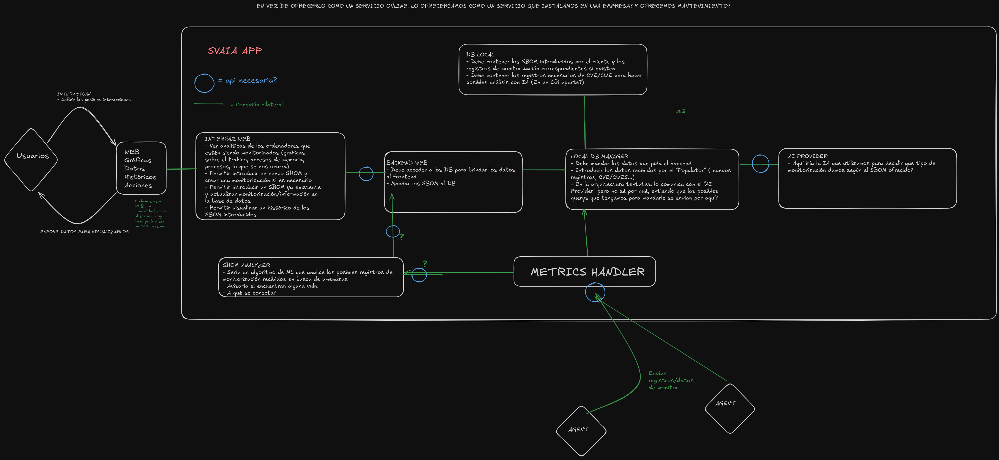
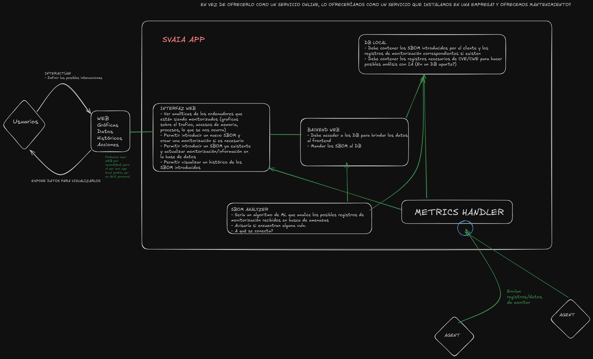

# Cosas a tener en cuenta
Hemos tenido numerosas dificultades en cuanto al proceso de armonizar lo hecho en las prácticas con la realidad del proyecto.
El hecho de realizar la web en una asignatura a parte, con prisas en gran medida debido a la taxonomía de las entregas y sin pensar mucho en el proyecto, ha hecho que la materialización de la arquitectura prevista haya sido complicada.

Tampoco hemos podido enlazar con la base de datos hecha en las prácticas, puesto que se aleja de lo que necesitabamos para nuestro proyecto. Es por esto que hay una pequeña base de datos local en el proyecto para poder probarlo.

La arquitectura prevista era la siguiente:

Bastante modular y consistente.

Sin embargo, por la falta de experiencia/tiempo/codigo reutilizado/etc. ha resultado algo así:

Algunas decisiones como la de comunicación via websockets es deliberada, otras, resultado de todo lo previamente dicho.
El trabajo ha sido una buena tarea para hacernos ver la dificultad de crear un software limpio y estructurado, es por esto que, tras
realizarlo, es coherente descartar este trabajo como un borrador y comenzar de 0 para hacer las cosas sin prisa y
de manera estructurada, cohesionando todas las partes.
